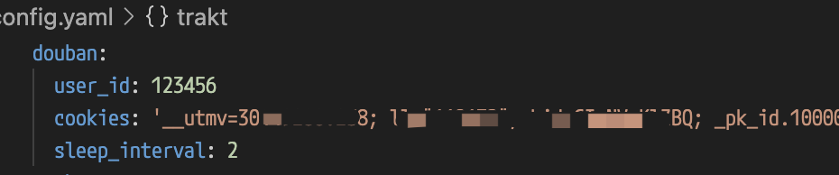
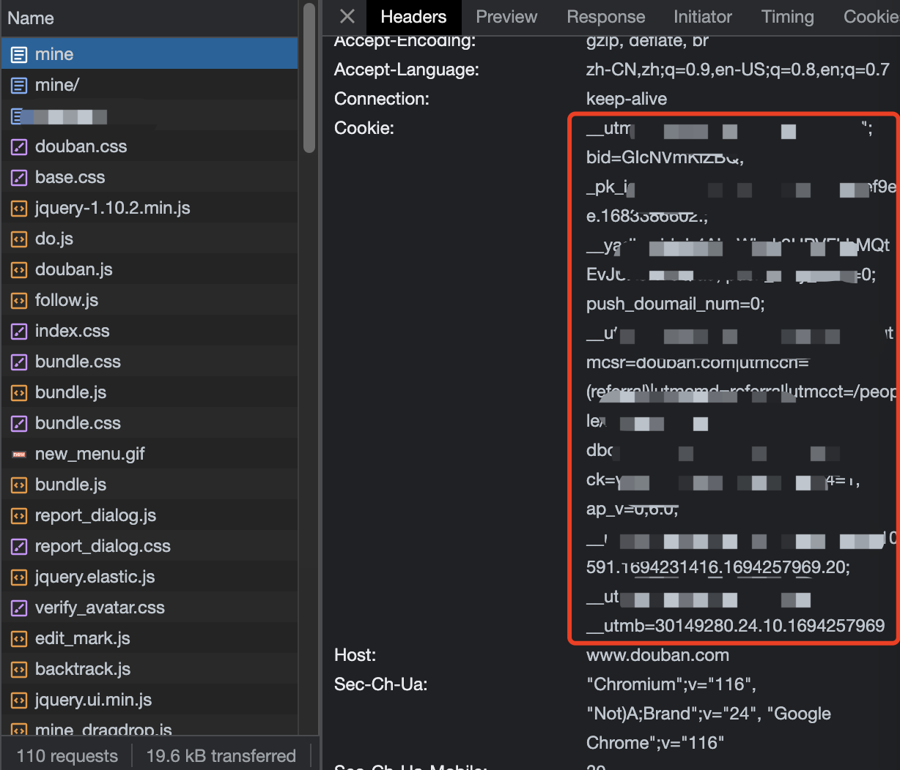
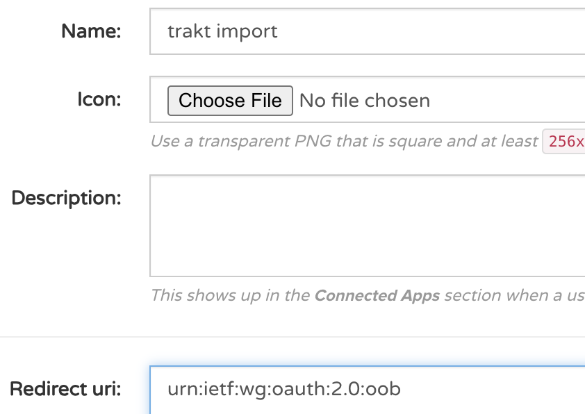

# douban-to-trakt

本脚本用于将douban上的“看过”，“想看”记录导入至trakt上。
步骤分两步

1. 从douban上导出至csv文件。
2. 将csv文件导入至trakt。

## 操作步骤

1. 安装依赖
   
   - [pyenv](https://github.com/pyenv/pyenv)
   - [pyenv-virtualenv](https://github.com/pyenv/pyenv-virtualenv) 

2. 配置虚拟python环境
   
   ```shell
   pyenv install 3.11.0
   pyenv virtualenv 3.11.0 douban-to-trakt
   pyenv activate douban-to-trakt
   pip install -r requirements.txt
   ```

3. 配置douban信息
   
   
   
   - 获取'user_id'：打开个人主页[https://www.douban.com/mine](https://www.douban.com/mine)，重定向后在地址栏中获取
     
     
   
   - 获取'cookies' ：登录douban后在chrome开发者选项中获取
     
     

4. 导出douban记录
   
   执行`python douban_to_csv.py`开始导出
   
   ```shell
   douban-to-trakt λ python douban_to_csv.py
   
   19:53:37     INFO Scrape for "xxx"...
   19:53:37    DEBUG Load previous scraped movies from workspace/output/douban.csv
   19:53:37    DEBUG 1689 items loaded, collect: 1514, wish: 175
   19:53:37     INFO Scraping "collect"...
   19:53:39     INFO   "collect" has total 101 pages, 1514 items
   19:53:39     INFO   Scrape with start=0...
   19:53:42    DEBUG     Get 15 items
   19:53:42    DEBUG     Get item "黑匣子 / Boîte noire" with idmb: "tt10341034"
   19:53:42    DEBUG     Get item "阿凡达：水之道 / Avatar: The Way of Water" with idmb: "tt1630029"
   19:53:42    DEBUG     Get item "重启人生 / ブラッシュアップライフ" with idmb: "tt26134148"
   ```

5. 配置trakt信息
   在[Trakt.tv application](https://trakt.tv/oauth/applications) 创建应用获取 `client_id` 和 `client_secret`，只需填写`name`和`Redirect uri`(固定为`urn:ietf:wg:oauth:2.0:oob`)，再点 `SAVE APP`即可获取 `client_id` 、 `client_secret`和`redirect_uri`。
   
   

6. 导入trakt记录
   
   执行`python csv_to_trakt.py`开始导入，按提示点击链接获取Pin码，等待结束即可。
   
   ```shell
   douban-to-trakt λ python csv_to_trakt.py
   
   20:20:42    DEBUG   [1/30]  Update information for tt0146984 - 重返荣耀 / The Legend of Bagger Vance
   20:20:45    DEBUG     Get trakt success, id: 2891, type: movie, link: https://trakt.tv/movies/the-legend-of-bagger-vance-2000
   20:20:45    DEBUG   [2/30]  Update information for tt1488589 - 吉尔莫·德尔·托罗的匹诺曹 / Guillermo Del Toros Pinocchio
   20:20:45    DEBUG     Get trakt success, id: 406579, type: movie, link: https://trakt.tv/movies/guillermo-del-toro-s-pinocchio-2022
   20:20:45    DEBUG   [3/30]  Update information for tt5537002 - 花月杀手 / Killers of the Flower Moon
   ...
   20:21:41     INFO watchlist: add 15(13 movies, 2 seasons) items to watchlist...
   20:21:42     INFO   Already added: 15(13 movies, 2 seasons) items
   20:21:42     INFO   To add: 0 items
   20:21:42     INFO watchlist: end of add items to watched
   
   20:21:42     INFO watched: add 15(12 movies, 3 seasons) items to watched...
   20:21:47     INFO   Already added: 15(12 movies, 3 seasons) items
   20:21:47     INFO   To add: 0 items
   20:21:47     INFO watched: end of add items to watched
   
   20:21:47     INFO ratings: add 15(12 movies, 3 seasons) items to ratings...
   20:21:49     INFO   Already added: 15(12 movies, 3 seasons) items
   20:21:49     INFO   To add: 0 items
   20:21:49     INFO ratings: end of add items to watched
   ```

## 其它

- 打分
  
  douban打分为5分制，trakt为10分制，默认分数会*2，可以手工修改`douban.csv`文件较正。
* 评论
  
  trakt要求评论为英文，中文评论大概率会失败。

## 感谢

* [GitHub - fisheepx/douban-to-imdb: 导出豆瓣电影评分到 IMDB，再将 IMDB观看记录导入 Trakt.](https://github.com/fisheepx/douban-to-imdb)

* [GitHub - fuzeman/trakt.py: Python interface for the Trakt.tv API](https://github.com/fuzeman/trakt.py)
